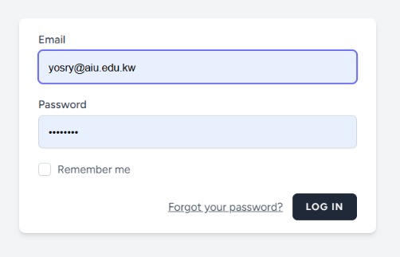
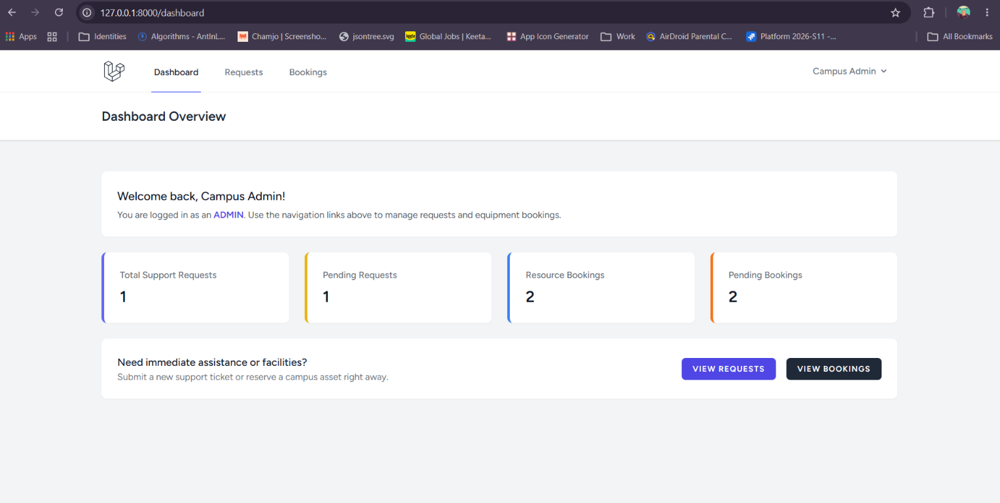
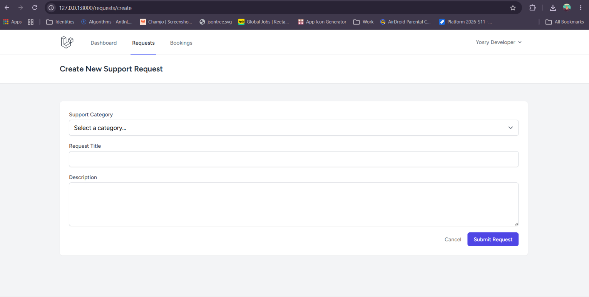
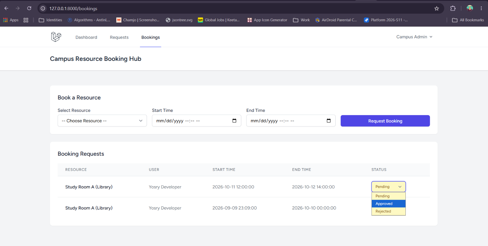
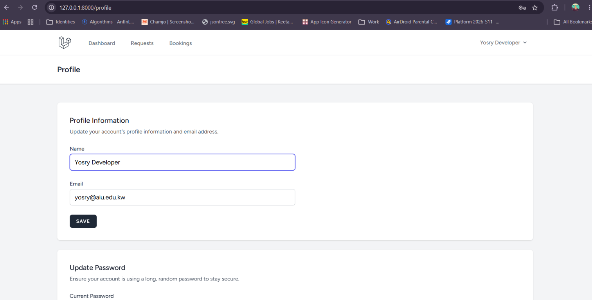

# Campus Hub — Campus Request & Resource Booking Platform

[](https://github.com/codebyyosry/campus-hub/actions/workflows/laravel.yml)


[](https://github.com/codebyyosry/campus-hub/stargazers)
[](https://github.com/codebyyosry/campus-hub/network/members)
[](https://github.com/codebyyosry/campus-hub/commits/main)
[](https://github.com/codebyyosry/campus-hub/issues)

A centralized enterprise platform engineered to streamline campus operational workflows, process support requests with interactive threaded comments, and manage resource bookings seamlessly. Built with **Laravel 11**, **Laravel Breeze**, and **Tailwind CSS**.

**Repository:** [github.com/codebyyosry/campus-hub](https://github.com/codebyyosry/campus-hub)

---

## 📸 Screenshots

> All screenshots are stored in the `/screenshots` folder. Rename your image files to match the names below (or update the paths here to match your actual filenames).

|              Login              |                   Dashboard                   |
| :-----------------------------: | :-------------------------------------------: |
|  |  |

|                  Support Requests                  |                      Request Details                      |
| :------------------------------------------------: | :-------------------------------------------------------: |
|  |  |

|                  Create Request                   |                  Resource Bookings                   |
| :-----------------------------------------------: | :--------------------------------------------------: |
|  |  |

|               Profile Settings               |
| :------------------------------------------: |
|  |

---

## 🚀 Project Overview & Features

- **Support Requests:** Submit, track, and administer campus maintenance or administrative help tickets with state tracking and updates.
- **Threaded Discussions:** Engage in targeted discussions, exchange clarifications, and log progress notes directly inside individual ticket views.
- **Resource Bookings:** Reserve labs, equipment, conference rooms, and campus amenities with structured scheduling and approval pipelines.
- **Robust Authentication:** Secure login, registration, password resets, and email verification powered by Laravel Breeze.

---

## 🛠️ Technical Stack & Architecture

- **Backend Framework:** Laravel 11 (Routing, Eloquent ORM, Middleware Protection)
- **Authentication:** Laravel Breeze
- **Frontend:** Blade Templating, Tailwind CSS, Vite asset compiler
- **Database:** MySQL (development & production), SQLite (automated testing)
- **Testing:** PHPUnit feature testing suite

---

## 📋 Platform Routes & Navigation Map

| Endpoint / Path    | Controller / Action             | Middleware Protection | Description                                                                |
| :----------------- | :------------------------------ | :-------------------- | :------------------------------------------------------------------------- |
| `/`                | Welcome View (Readme)           | `Public`              | Project introduction, routes reference, and quick authentication triggers. |
| `/dashboard`       | DashboardController@index       | `auth`, `verified`    | Real-time metrics, active bookings summary, and request tracking overview. |
| `/requests`        | SupportRequestController@index  | `auth`                | Browse and filter campus support tickets and maintenance requests.         |
| `/requests/create` | SupportRequestController@create | `auth`                | Form interface to raise a new support issue or request help.               |
| `/requests/{id}`   | SupportRequestController@show   | `auth`                | View detailed request description, status updates, and threaded comments.  |
| `/bookings`        | ResourceBookingController@index | `auth`                | Overview of campus resource allocations, rooms, and equipment schedules.   |
| `/profile`         | ProfileController@edit          | `auth`                | Manage user credentials, security passwords, and account termination.      |

---

## ⚙️ Local Setup & Installation Instructions

Follow these steps to set up and run Campus Hub locally on your machine:

### 1. Clone the Repository

```bash
git clone https://github.com/codebyyosry/campus-hub.git
cd campus-hub
```

### 2. Install PHP Dependencies

```bash
composer install
```

### 3. Configure Environment Variables

Copy the example environment configuration file and generate your application key:

```bash
cp .env.example .env
php artisan key:generate
```

### 4. Configure Database

This project uses **MySQL** for development and production, and **SQLite** for running the automated test suite.

**Development / Production (`.env`):**

```dotenv
DB_CONNECTION=mysql
DB_HOST=127.0.0.1
DB_PORT=3306
DB_DATABASE=campus_hub
DB_USERNAME=root
DB_PASSWORD=
```

Make sure MySQL is running locally and that a database named `campus_hub` exists:

```bash
mysql -u root -p -e "CREATE DATABASE campus_hub;"
```

**Testing (`phpunit.xml`):**

Tests run against an in-memory SQLite database for speed and isolation:

```xml
<env name="DB_CONNECTION" value="sqlite"/>
<env name="DB_DATABASE" value=":memory:"/>
```

_(This is already configured in `phpunit.xml` — no extra setup needed to run tests.)_

### 5. Run Database Migrations & Seeders

Run the migration and seeding commands to construct the database schema and prepopulate testing credentials:

```bash
php artisan migrate --seed
```

### 6. Install Frontend Dependencies & Compile Assets

```bash
npm install
npm run dev
```

_(Keep `npm run dev` running in a separate terminal window to compile Tailwind CSS assets via Vite)._

### 7. Start the Local Development Server

Open another terminal window and start the Laravel local server:

```bash
php artisan serve
```

Access your application in your browser at `http://127.0.0.1:8000`.

---

## 🔐 Environment Notes

- **`APP_DEBUG`** — Keep `true` for local development, but always set to `false` before deploying to production. Debug mode exposes stack traces and environment details on error pages.
- **`MAIL_MAILER`** — Defaults to `log`, meaning emails (e.g. verification, password reset) are written to `storage/logs/laravel.log` instead of being sent. Use a tool like Mailpit or Mailtrap locally to preview real emails, and switch to a provider like SES, Mailgun, or Postmark in production.
- **`SESSION_DRIVER` / `CACHE_STORE` / `QUEUE_CONNECTION`** — All set to `database`, which requires the `sessions`, `cache`, and `jobs` tables. These are created automatically by `php artisan migrate`.

---

## 🧪 Running Tests

To execute the test suite and ensure all features pass successfully:

```bash
php artisan test
```

---

## 📄 License

This project is open-source software.

---

## 👤 About the Author

**Yosry Badr** — Senior Android Developer & Solution Architect

I'm a Computer Science graduate from Ain Shams University with 5+ years of experience building high-performance Android applications (Kotlin, Jetpack Compose, Clean Architecture) and full-stack/backend systems across fintech, healthcare, and enterprise platforms. Campus Hub is a Laravel-based exploration of full-stack web development alongside my primary mobile engineering work.

- 🌐 **Portfolio:** [codebyyosry.github.io](https://codebyyosry.github.io/)
- 💻 **GitHub:** [@codebyyosry](https://github.com/codebyyosry)
- 💼 **LinkedIn:** [in/yosry-badr](https://www.linkedin.com/in/yosry-badr/)
- 📧 **Email:** yosry.jobs@gmail.com

Feel free to reach out for collaboration, feedback, or opportunities.
